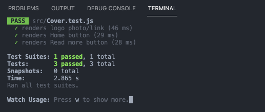

# User Story
-to check on news,stats,scores, and more for the NFL

# ScreenShot


# Installation Instructions
- Fork and clone the repository
- CD into nfl-website
- Run NPM Install
- Run NPM start

# Component
```js
const displayMenuList = menuList.map((menu,index)=>{
    return (
       <Menu key={index} link={menu.link} name={menu.name} />
    )
})

```

# DATA 
```js
const header = {
    title: 'Breaking News: NFL postpones three Week 15 games due to COVID-19 surge',
    subTitle: 'A surge in COVID-19 cases across the NFL and United States as a whole has resulted in the postponement of multiple Week 15 games. ',
    link: 'https://www.nfl.com/news/nfl-covid-week-15-game-postponement'
}
```

# Test


```js
 test('renders Home button', () => {
    render(<Cover />);
    const spanElement = screen.getByText(/Home/i);
    expect(spanElement).toBeInTheDocument();
  });

```
